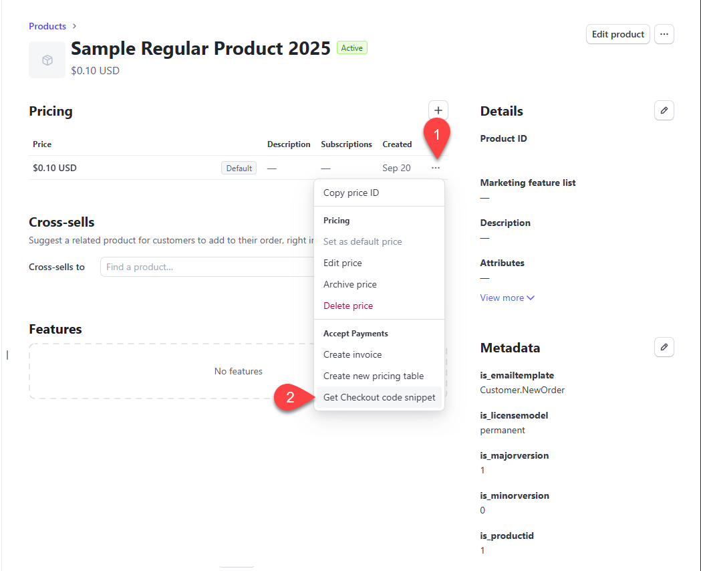

# Method 2: IPN

Integration with 2Checkout is also possible though 2Checkout IPN system. This method is suitable for regular and subscription products. It is supported as of QLM 19.1.25310.1.

### IPN Configuration

* Login in to your 2checkout  system
* Expand the Integrations node and select Webhooks & API
* Go to the IPN Settings tab
* Click "Add IPN URL"
* Set the URL to:&#x20;
* > [https://yourserver/qlmlicenseserver/qlmservice.asmx/QlmWebHookHandler?is\_vendor=avangate\&is\_user=tom\&is\_pwd=xyz
  > ](https://qlm4.net/qlmdemo/qlmlicenseserver/qlmservice.asmx/QlmWebHookHandler?is_vendor=avangate\&is_user=tom\&is_pwd=xyz)
* You should update the URL above to point to your server and update the user/password to match the user/password that you specified when you enabled the 2checkout/Avangate extension in the QLM Management Console.
* On the IPN Settings tab,:
  * Take note of the Secret Key. You will need it later on.
  * In the Triggers section, make sure that the following option is selected: Authorized and approved orders (sent after electronic delivery)
  * In the Response Tags section, make sure the following fields are selected:

<figure><figcaption></figcaption></figure>

### 2Checkout product configuration

* Create your product in 2Checkout
* On the Fulfillment tab, select the following option:

<figure><figcaption></figcaption></figure>

#### Mapping your 2Checkout product to the QLM product

To map your 2Checkout product to a QLM product, you must identify your 2Checkout Product ID and then create a QLM Custom Server Property.&#x20;

#### Identify your 2Checkout Product ID

* Login to your 2Checkout account
* Go to the Setup/Products section
* The ID of the product is typically the first column  of the table listing your products
* Note your Product ID as you will use it in the next step

### Enabling 2Checkout/Avangate in QLM

* Launch the QLM Management Console
* Go to the Manage Keys tab
* Click **3rd Party Extensions**
* Click Avangate
* Check the "Enabled" checkbox
* Set a user/password (of your choice)
* Set the Shared Key field to the Secret Password noted above.
* Click Ok

<figure><figcaption></figcaption></figure>

### Create a QLM Server Property

Next, you will create a QLM Custom Server property that maps your 2Checkout product to a QLM product.

* Launch the QLM Management Console
* Go to the Manage Keys tab
* Click Sites then select your site
* Go to the Server Properties tab
* Click the + sign on the right-hand side to add a new custom server property
* Set the property name to: pid\_<2Checkout Product ID>. For example, if your 2Checkout Product ID is 8019770900775, set the name to: pid\_8019770900775
* Set the value of the property to (modify the values to correspond to your own product): \&is\_productid=1\&is\_majorversion=1\&is\_minorversion=0\&is\_productname=MyProduct\&is\_emailtemplate=Customer.NewOrder\&is\_licensemodel=subscription
* For more information about the supported arguments for an initial order, refer to this[ article](../../api-reference/http-methods/getactivationkeywithexpirydate.md).
* To send a different email message for a subscription renewal, add the following argument to the server property: \&is\_emailtemplate\_renew=\<Renewal Email Template> (replace the email template name as needed).
* Click Ok

<figure><figcaption></figcaption></figure>

### Place a test order

To place a test order:

* Click on the Products menu item then select your product.
* Click on the Information tab.
* Click on "Get buy links for this product"
* Scroll down the page and click on "Place a test order"
* Fill in the order form and submit the order
* A license key will be automatically and emailed to the customer

Tips: Credit Card: 4111111111111111, CVV: 123

Name: John Doe

### Subscription Renewal

If the initial order was for a subscription product, the license key created during the initial purchase will have the expiry date that corresponds to the subscription expiry date.

When the renewal is triggered from 2Checkout, QLM automatically updates the expiry date of the license based on the renewal expiry date.

### IDN Response

When an order is placed with 2Checkout, you have the option of automatically fulfilling the order after payment is received or waiting for a confirmation from QLM that license keys were properly created and sent before flagging the order as fulfilled.

The steps described above will flag the order as fulfilled as soon as payment is received regardless of the success of the QLM process.

To wait for conformation from QLM in order to flag the order as fulfilled you must configure the 2Checkout [IDN Response ](https://verifone.cloud/docs/2checkout/API-Integration/Webhooks/API-Message-Services/Instant-Delivery-Notification-%28IDN%29)feature as follows :

* For each product definition in 2Checkout, set the Fulfillment option to "Fulfillment made by you".  Do not check the option "Start subscription after fulfillment". If you do so, 2checkout does not send expiry date information to QLM and hence the license keys will not be created properly (see screenshot below).\

* When creating the QLM custom server property, add the following argument to each property that is configured to receive an IDN response: \&is\_sendresponse=true

<figure><figcaption></figcaption></figure>
