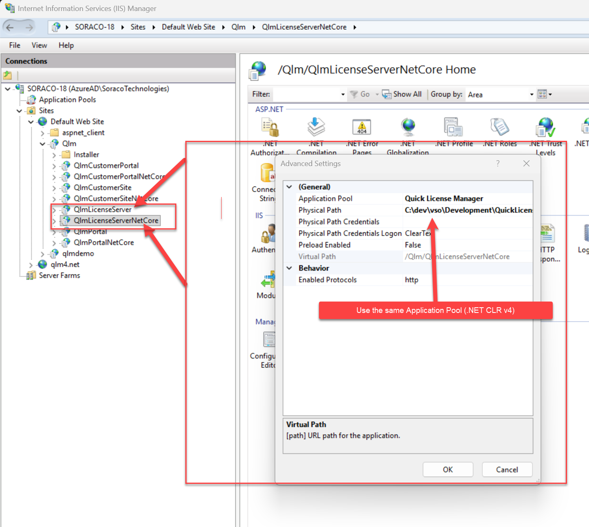

# Stripe - How to integrate QLM with Stripe Checkout

If you use Stripe Checkout as an eCommerce provider, QLM integrates seamlessly with Stripe Checkout's ordering system.&#x20;

To have Stripe invoke QLM during an order, do the following in the Stripe Control Panel: &#x20;

### Configure the webhook

* Login to Stripe.com and go to your Dashboard
* Click the Developers item then select Webhooks
* Click "Add endpoint"
* In the URL field, enter the URL to your QLM License Server and append the following to the URL: /QlmWebHookHandler?is\_vendor=stripe\&is\_user=\<user>\&is\_pwd=\<pwd>

where:

\<user>: As defined in the QLM Management Console / Manage Keys / 3rd Party Extensions

\<pwd>: As defined in the QLM Management Console / Manage Keys / 3rd Party Extensions

Example: https://qlm3.net/qlmdemo/qlmLicenseServer/qlmservice.asmx/QlmWebHookHandler?is\_vendor=stripe\&is\_user=tim\&is\_pwd=timpassword&#x20;

* In the "Events to send" drop-down, select the following items:
  * For regular products
    * checkout.session.completed
  * For subscription products
    * customer.subscription.deleted
    * invoice.payment\_succeeded
* Click "Add endpoint"

### Get Your Stripe Secret Key

QLM requires the Stripe Secret Key to connunicate with Stripe. To get the Stripe Secret Key:

* Login to Stripe.com and go to your Dashboard
* Click the Settings icon (gear) on the top right&#x20;
* Click the Developers item&#x20;
* Expand the Developers section at the bottom of your browser
* In the Overview section, click "Manage API Keys"
* Get the Secret Key&#x20;

### &#x20;Enable Stripe in QLM&#x20;

* Launch the QLM Management Console
* Go to the Manage Keys tab
* Click 3rd party extensions
* Select Stripe
* Check the "Enabled" checkbox
* Set the API Key to the value of the Stripe Secret Key&#x20;
* Click Ok

### Regular Products

* Create a new product of type "One-time purchase products" and set the required fields.
* In the Metadata section of the product, add the following entries:

| is\_productid                | 1             |
| ---------------------------- | ------------- |
| is\_majorversion             | 1             |
| is\_minorversion             | 0             |
| is\_licensemodel             | permanent     |
| is\_vendor                   | stripe        |
| is\_emailtemplate            | 1. New Order  |
| is\_features                 | 0:1           |
| is\_send\_mail (as of v18.1) | true \| false |

where

* is\_productid = your product id as defined in QLM
* is\_majorversion = your product's major version as defined in QLM
* is\_minorversion = your product's minor version as defined in QLM
* is\_features = semi-comma-separated list of feature sets and their corresponding values. Example: is\_features=0:3;1:1. This means that in feature set 0, features 1 + 2 are enabled and in feature set 1, feature 1 is enabled.
* is\_user = As defined in Manage Keys / 3rd Party Extensions
* is\_pwd = As defined in Manage Keys / 3rd Party Extensions
* is\_emailtemplate = email template to use when sending the email to the user. Email templates can be created from the QLM Management Console / Manage Keys / Email Templates
* is\_licensemodel = permanent | trial | subscription&#x20;
* is\_send\_mail: instructs QLM to send an email after processing the order

<figure><figcaption></figcaption></figure>

<figure><figcaption></figcaption></figure>

### Subscription Products

* Create a new product of type "Recurring products" and set the required fields.
* In the Metadata section of the product, add the following entries:

| is\_productid                          | 1                                        |
| -------------------------------------- | ---------------------------------------- |
| is\_majorversion                       | 1                                        |
| is\_minorversion                       | 0                                        |
| is\_licensemodel                       | subscription                             |
| is\_vendor                             | stripe                                   |
| is\_emailtemplate                      | \<Email template to use for a new order> |
| is\_renewal\_emailtemplate             | \<Email template to use for a renewal>   |
| is\_features                           | 0:1                                      |
| is\_send\_mail ( as of v18.1)          | true \| false                            |
| is\_send\_renewal\_mail ( as of v18.1) | true \| false                            |

where

* is\_productid = your product id as defined in QLM
* is\_majorversion = your product's major version as defined in QLM
* is\_minorversion = your product's minor version as defined in QLM
* is\_features = semi-comma-separated list of feature sets and their corresponding values. Example: is\_features=0:3;1:1. This means that in feature set 0, features 1 + 2 are enabled and in feature set 1, feature 1 is enabled.
* is\_user = As defined in Manage Keys / 3rd Party Extensions
* is\_pwd = As defined in Manage Keys / 3rd Party Extensions
* is\_emailtemplate = email template to use when sending the initial order email to the user. Email templates can be created from the QLM Management Console / Manage Keys / Email Templates
* is\_renewal\_emailtemplate = email template to use when sending the renewal email to the user
* is\_licensemodel = permanent | trial | subscription&#x20;
* is\_send\_mail: instructs QLM to send an email after processing the initial order
* is\_send\_renewal\_mail: instructs QLM to send an email after processing the renewal

### Enable Stripe Checkout&#x20;

To enable Stripe Checkout:

* In the Stripe dashboard, go to Settings
* Click "Checkout settings"
* Click "Enable client-only integration

Once Stripe Checkout is enabled, enter **your** web site domain name in the Domains field:

### Create the Stripe Checkout button

* In the Stripe dashboard, go to Products
* Select your product
* In the Pricing section, for a given price, click "..." then select "Get Checkout code snippet". If you do not have a Price item, add one.&#x20;
* In the Checkout snippet generator window, update the Success URL and Cancel URL to point to valid URLs
* Copy the generated code and save it in a file on your desktop then publish it to your web site

<figure><figcaption></figcaption></figure>

<figure><figcaption></figcaption></figure>

### Testing an order

* Open the file saved in the previous step from a URL (do not test from your local machine)
* Click the Checkout button and place an order
* Once the order is completed, the following will occur:
  * A new user will be automatically added to the QLM database based on the information collected during the ordering process.
  * An activation key will be created in the QLM database and associated with the user.
  * An email will be sent to the user with the order information and activation keys

&#x20;In order for QLM License Server to send emails, you need to configure your SMTP server. Detailed instructions can be found in this [article](https://support.soraco.co/hc/en-us/articles/207894796-How-to-configure-QLM-to-send-mail-using-SMTP), in the section **Configure the QLM License Server to send emails using SMTP.**
