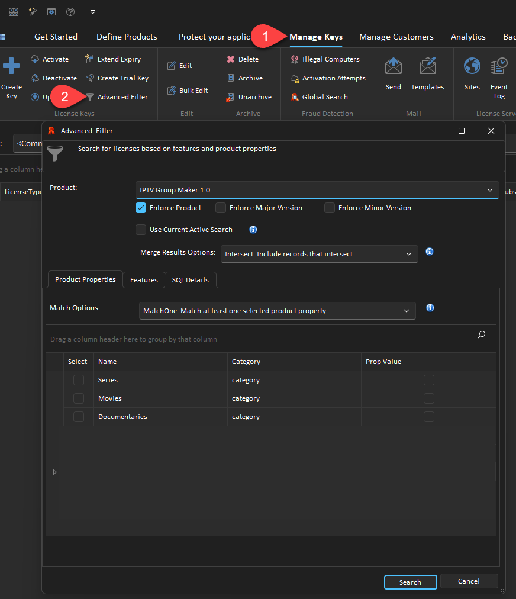

# Advanced Filter

The Advanced Filter feature allows you to perform searches based on QLM Features and QLM Product Properties values.

Below is a description of the options available to customize your search:

* Product: Select the product that you want to search for. Since features and properties are product dependent, the search should be for a given product.
* Enforce Product: When performing the search, only return results for the given product. If you uncheck this option, the results will be indeterministic unless all your products have the same features and product properties.
* Enforce Major Version: When performing the search, only return results for the given Major Version.
* Enforce Minor Version: When performing the search, only return results for the given Minor Version.
* Use Current Active Search: use the search currently active in the Manage Keys tab as a starting point for the Advanced Search.
* Merge Result Options: when filtering data based on features and product properties, determine whether the results should match either condition (Union) or both conditions (Intersection).
* Product Properties
  * Match Options: determine whether a license should be considered a match if at least one of the selected product properties meets the specified criteria (MatchOne) or whether all specified product properties should match (MatchAll).
* Features
  * Match Options: determine whether a license should be considered a match if at least one of the selected features meets the specified criteria (MatchOne) or whether all specified features should match (MatchAll) or whether all the specified features should match exclusively (MatchAllExclusive)

&#x20;
