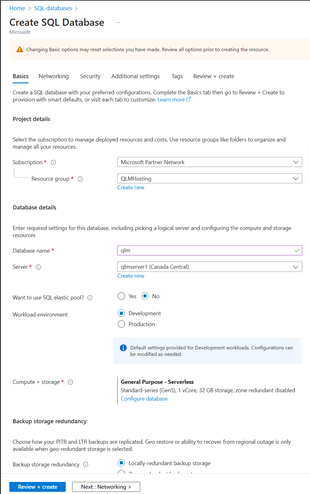
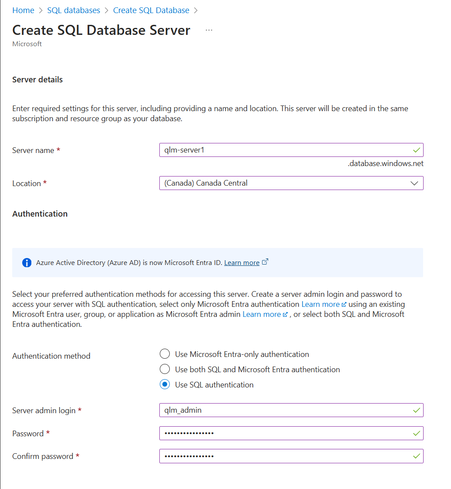
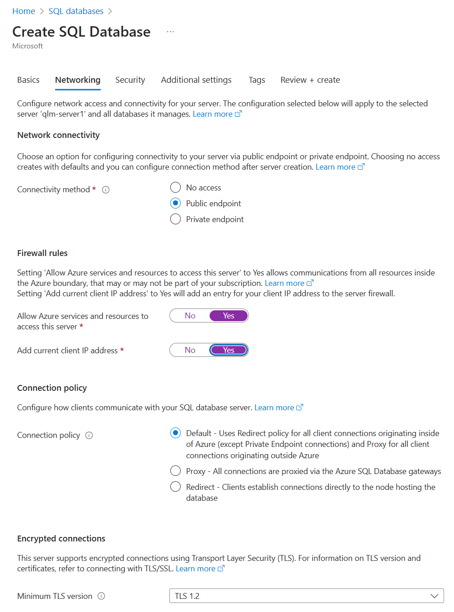
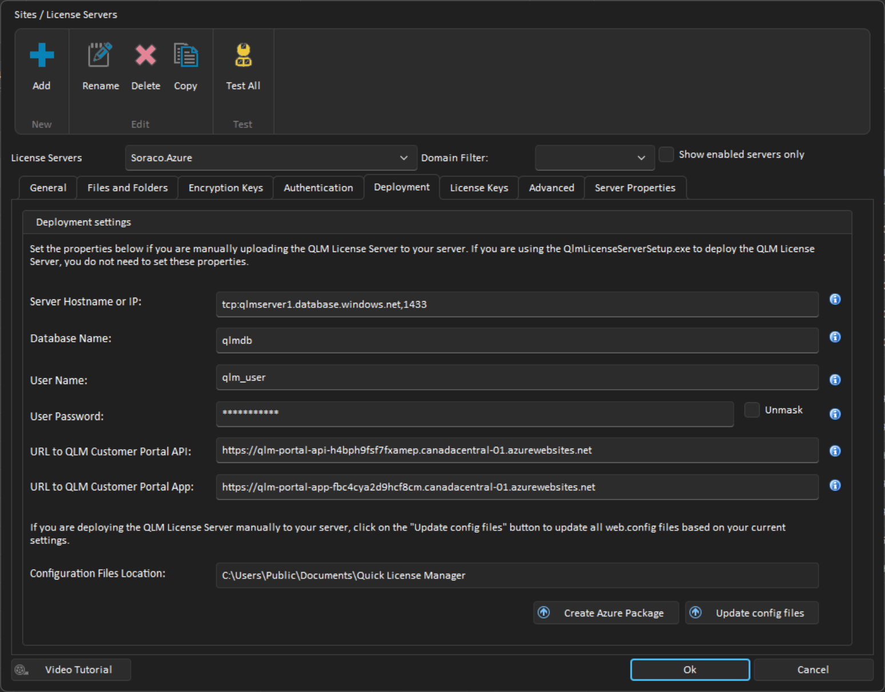

# QLM v12+ Azure Integration

The QLM License Server can be hosted on a Windows Azure portal. The procedure outlined in this section will show you how to build a QLM Azure deployment package, how to create the database on the Azure Portal and finally how to connect the QLM Management Console to the Azure-hosted QLM License Server.

### 1. Database Creation

To create the QLM database on the Azure portal:

<table data-header-hidden><thead><tr><th></th><th data-hidden></th></tr></thead><tbody><tr><td><table data-header-hidden><thead><tr><th></th></tr></thead><tbody><tr><td><ul><li>Go to the Windows Azure Portal.</li></ul></td></tr><tr><td><ul><li>Select <strong>SQL Databases.</strong></li></ul></td></tr><tr><td><ul><li>Click Create<strong>.</strong></li></ul></td></tr><tr><td><ul><li>Pick the Subscription, and Resource Group server of your choice.</li></ul></td></tr><tr><td><ul><li>Set the database name to: qlm</li></ul></td></tr><tr><td><ul><li>Select an existing Server or create a New Server</li></ul></td></tr><tr><td><ul><li>Select whether you want to use a SQL Elastic pool</li></ul></td></tr><tr><td><ul><li>Select the workload Environment: Development | Production</li></ul></td></tr><tr><td><ul><li>Select the Compute + Storage base on your requirements</li></ul></td></tr><tr><td>Select your backup storage redundacy</td></tr><tr><td><ul><li>Click Review + <strong>Create</strong></li></ul></td></tr></tbody></table></td><td></td></tr></tbody></table>

<figure><figcaption></figcaption></figure>

### 2. Server settings

If you selected to create a new SQL database server in the previous step, you need to configure a user account on the SQL Server.

<table data-header-hidden><thead><tr><th></th><th data-hidden></th></tr></thead><tbody><tr><td><table data-header-hidden><thead><tr><th></th></tr></thead><tbody><tr><td><ul><li>In the Server name field, enter a name of your choice. Example: qlm-server</li></ul></td></tr><tr><td><ul><li>Select a Location</li></ul></td></tr><tr><td><ul><li>Set the Authentication method to "SQL Authentication" or "both SQL and Entra Authentication"</li></ul></td></tr><tr><td><ul><li>In the Server admin login field, enter a name of your choice. Example: qlm_admin</li></ul></td></tr><tr><td><ul><li>In the password and confirm password fields, enter a new password. IMPORTANT: Use a password that contains a combination of lower case, upper case, digits and special characters.</li></ul></td></tr><tr><td><ul><li>Click Ok</li></ul></td></tr></tbody></table></td><td></td></tr></tbody></table>

<figure><figcaption></figcaption></figure>

### Networking

* Set the Connectivity Method to **Public endpoint.**
* Set the **Allow Azure services and resources to access this server** property to **Yes.**&#x20;
* Set the **Add current IP address** property to **Yes.**&#x20;
* **Set the Connection Policy to Default**
* Set the "Minimum TLS Version" to 1.0. This is required as the default OLEDB drivers that are available on Azure App Services do not currently support TLS 1.2 and there does not seem to be a way to update these drivers.

<figure><figcaption></figcaption></figure>

### Configure the database

Now that the database is created, we need to create a user account, tables and stored procedures. Follow the steps below:

<table data-header-hidden><thead><tr><th></th><th data-hidden></th></tr></thead><tbody><tr><td><table data-header-hidden><thead><tr><th></th></tr></thead><tbody><tr><td><ul><li>Install SQL Server Management Studio (SSMS) on your local computer</li><li>Launch SSMS</li><li>
Create the Login Account
<ul><li>Click Connect</li><li>Set the Server Name to the URL of your server. Example:  qlmserver1.database.windows.net </li><li>Set the Login name to: qlm_admin</li><li>Enter your password: &#x3C;password></li><li>Click the Options button</li><li>Set the "Connect to database" to: &#x3C;default></li><li>Click Connect</li><li>Right-mouse click the server in SSMS and select New Query</li><li>Paste the following code (update the password as needed): CREATE LOGIN [qlm_user] WITH PASSWORD = 'Coraso23!';</li><li>Click Execute</li><li>Right-mouse click the server in SSMS and select Disconnect</li></ul></li></ul>

</td></tr></tbody></table></td><td></td></tr><tr><td><ul><li>
Create the tables and DB user account
<ul><li>In SSMS, click Connect</li><li>Set the Server Name to the URL of your server. Example:  qlmserver1.database.windows.net </li><li>Set the Login name to: qlm_admin</li><li>Enter your password: &#x3C;password></li><li>Click the Options button</li><li>Set the "Connect to database" to: qlm_db</li><li>Click Connect</li><li>Right-mouse click the server in SSMS and select New Query</li><li>Click Open Query and select: %Public%\Documents\Quick License Manager\DeployToAzure\Db\qlm.createtables.sql</li><li>Click on Execute to run the query</li><li>Repeat these two steps for the following sql script file: aspnet.sql</li><li>Repeat these two steps for the following sql script file: qlm.createuser.sql</li><li>Right-mouse click the server in SSMS and select Disconnect</li></ul></li></ul>

</td><td></td></tr><tr><td></td><td></td></tr><tr><td>

<ul><li>
Validate the previous steps:
<ul><li>In SSMS, click Connect</li><li>Set the Server Name to the URL of your server. Example:  qlmserver1.database.windows.net </li><li>Set the Login name to: qlm_user</li><li>Enter your password: &#x3C;password></li><li>Click the Options button</li><li>Set the "Connect to database" to: qlm_db</li><li>Click Connect</li><li>Expand the database tables node and verify that the tables were created</li></ul></li></ul></td><td></td></tr><tr><td></td><td></td></tr></tbody></table>

### &#x20;

### Create the QlmLicense Server App Service

* Click App Services in the Azure Portal
* Click "Create app service"
* Select "Web App"
* Click Create
* Set the App Name to: QlmLicenseServer (or any name of your choice)
* Select your subscription
* Select a Resource Group or create a new one
* Set the Publish property to: Code
* Set the Runtime Stack to: ASP.NET V4.8
* Set the OS to: Windows
* Set a Region of your choice
* Select the App Service plan
* Click Create
* Click App Services to view the newly created App Service
* Locate and note the URL to access the App Service in Azure. The URL will look like: [https://qlmlicenseserver.azurewebsites.net](https://qlmlicenseserver.azurewebsites.net/)

### Create the QlmCustomerSite App Service

* Click App Services in the Azure Portal
* Click "Create app service"
* Select "Web App"
* Click Create
* Select your subscription and resource group
* Set the App Name to: QlmCustomerSite
* Set the Publish property to: Code
* Set the Runtime Stack to: ASP.NET V4.8
* Set the OS to: Windows
* Set a Region of your choice
* Select the App Service plan
* Click Create
* Click App Services to view the newly created App Service

### Create the QlmPortal App Service

* Click App Services in the Azure Portal
* Click "Create app service"
* Select "Web App"
* Click Create
* Select your subscription and resource group
* Set the App Name to: QlmPortal
* Set the Publish property to: Code
* Set the Runtime Stack to: ASP.NET V4.8
* Set the OS to: Windows
* Select the App Service plan
* Click Create
* Click App Services to view the newly created App Service

### Create the QlmCustomerPortal API Service

* Click App Services in the Azure Portal
* Click "Create app service"
* Select "Web App"
* Click Create
* Select your subscription and resource group
* Set the App Name to: qlm-portal-api
* Set the Publish property to: Code
* Set the Runtime Stack to: ASP.NET V4.8
* Set the OS to: Windows
* Select the App Service plan
* Click Create
* Click App Services to view the newly created App Service
* Locate and note the URL to access the App Service in Azure. The URL will look like: [https://qlm-portal=api.azurewebsites.net](https://qlmlicenseserver.azurewebsites.net/)

### Create the QlmCustomerPortal APP Service

* Click App Services in the Azure Portal
* Click "Create app service"
* Select "Web App"
* Click Create
* Select your subscription and resource group
* Set the App Name to: qlm-portal-app
* Set the Publish property to: Code
* Set the Runtime Stack to: ASP.NET V4.8
* Set the OS to: Windows
* Select the App Service plan
* Click Create
* Click App Services to view the newly created App Service
* Locate and note the URL to access the App Service in Azure. The URL will look like: [https://qlm-portal=api.azurewebsites.net](https://qlmlicenseserver.azurewebsites.net/)

### Deploy packages to your App Services

Now that all App Services have been created, you need to create and deploy the QLM Azure packages to your App Services.

#### Create the App Packages

* Launch the QLM Management Console (v12+)
* Go to the Manage Keys tab
* Click Sites
* Click Add to add a new site
* Specify a site name
* In the Primary site field, enter the URL to the License Server: For example: [https://qlmlicenseserver.azurewebsites.net/qlmservice.asmx](https://qlmlicenseserver.azurewebsites.net/qlmservice.asmx)
* Set the Database Engine to SQL Server
* Go to the Encryption Keys tab, then click New for CommunicationEncryptionKey and AdminEncryptionKey
* If you want to configure the QLM Customer Portal to support 3rd party authentication, go to the Authentication tab and set the Client ID of each provider as described in the Authentication Configuration section of this [article](https://support.soraco.co/hc/en-us/articles/360049459532).
* Go to the Deployment tab (formerly Database Connection tab) and enter all the fields on this tab
  * Server Hostname or IP: to get this value, select your database in Azure, and click on the Overview tab.
    * Click Show database connection strings
    * In the ADO.NET tab, copy the value of the Server entry. The value typically looks like: tcp:qlm-server.database.windows.net,1433
  * Database Name: qlm or any other name you have entered earlier in the process when you created the database
  * User Name: name of the sql user created earlier (qlm\_user)\
    User Password: password of the sql user created earlier&#x20;
  * Set the URL to the QLM Customer Portal API (as per the App Service created earlier)
  * Set the URL to the QLM Customer Portal App (as per the App Service created earlier)
* Click "Create Azure Package"
* 4 zip files will be created. You will upload these zip files to your server in the next step.

<figure><figcaption></figcaption></figure>

#### Deploy the QLM License Server Package

* Go to the Azure Portal and click the QLM License Server App Service.
* In the right-hand panel, locate the Development Tools section and click Advanced Tools
* Click Go
* Click Debug Console / CMD
* Click **site** then **wwwroot** to go to the **wwwroot** folder
* Locate the QlmLicenseServer.zip file in %Public%\Quick License Manager\DeployToAzure
* Drag QlmLicenseServer.zip onto the grid where files are listed and drop it on the right-hand side of the grid where it says **Drag here to upload and unzip**.
* Once the deployment is completed, you can access the QLM License Server at the following URL: [https://qlmlicenseserver.azurewebsites.net](https://qlmlicenseserver.azurewebsites.net/)/qlmservice.asmx
* In the QLM Sites editor, go to the General tab
* Set the Primary Site value to: [https://qlmlicenseserver.azurewebsites.net/qlmservice.asmx](https://qlmlicenseserver.azurewebsites.net/qlmservice.asmx)
* Click the Test button to verify the connection to the server.
* If this is a new installation of the server, click "Upload your products to the License Server".

#### Deploy the QlmCustomerSite App Service

* Go to the Azure Portal and click the QLM Customer Site App Service.
* In the right-hand panel, locate the Development Tools section and click Advanced Tools
* Click Go
* Click Debug Console / CMD
* Click **site** then **wwwroot** to go to the **wwwroot** folder
* Locate the QlmCustomerSite.zip file in %Public%\Quick License Manager\DeployToAzure
* Drag QlmCustomerSite.zip onto the grid where files are listed and drop it on the right-hand side of the grid where it says **Drag here to upload and unzip**.
* Once the deployment is completed, you can access the QLM License Server at the following URL:[https://qlmcustomersite.azurewebsites.net](https://qlmcustomersite.azurewebsites.net/)

#### Deploy the QlmPortal App Service

* Go to the Azure Portal and click the QLM Customer Site App Service.
* In the right-hand panel, locate the Development Tools section and click Advanced Tools
* Click Go
* Click Debug Console / CMD
* Click **site** then **wwwroot** to go to the **wwwroot** folder
* Locate the QlmPortal.zip file in %Public%\Quick License Manager\DeployToAzure
* Drag QlmPortal.zip onto the grid where files are listed and drop it on the right-hand side of the grid where it says **Drag here to upload and unzip**.
* Once the deployment is completed, you can access the QLM Portal at the following URL: [https://qlmportal.azurewebsites.net/qlmportal.aspx](https://qlmportal.azurewebsites.net/qlmportal.aspx)

Is it recommended to set the Default Document of the QLM Portal to QlmPortal.aspx as follows:

* In the Azure QLM Portal panel, locate the Settings section and click Application Settings
* Locate the Default Documents section
* Click Add new document
* Enter QlmPortal.aspx
* Click Save

&#x20;

#### &#x20;

#### Deploy the QlmCustomerPortal API Service

* Go to the Azure Portal and click the QlmCustomerPortalAPi App Service.
* In the right-hand panel, locate the Development Tools section and click Advanced Tools
* Click Go
* Click Debug Console / CMD
* Click **site** then **wwwroot** to go to the **wwwroot** folder
* Locate the QlmCustomerPortalApi.zip file in %Public%\Quick License Manager\DeployToAzure
* Drag QlmCustomerPortalApi.zip onto the grid where files are listed and drop it on the right-hand side of the grid where it says **Drag here to upload and unzip**.
* Once the deployment is completed, you can access the QLM Portal API at the following URL: [https://qlm-portal-api.azurewebsites.net](https://qlmportal.azurewebsites.net/qlmportal.aspx)

#### Deploy the QlmCustomerPortalApp Service

* Go to the Azure Portal and click the QlmCustomerPortalApp App Service.
* In the right-hand panel, locate the Development Tools section and click Advanced Tools
* Click Go
* Click Debug Console / CMD
* Click **site** then **wwwroot** to go to the **wwwroot** folder
* Locate the QlmCustomerPortalApp.zip file in %Public%\Quick License Manager\DeployToAzure
* Drag QlmCustomerPortalApp.zip onto the grid where files are listed and drop it on the right-hand side of the grid where it says **Drag here to upload and unzip**.
* Drag and Drop QlmCustomerPortalApp.zip in the browser explorer area.
* Once the deployment is completed, you can access the QLM Portal API at the following URL: [https://qlm-portal-app.azurewebsites.net](https://qlmportal.azurewebsites.net/qlmportal.aspx)

Is it recommended to set the Default Document of the QLM Customer Portal App to index.html as follows:

* In the Azure QLM Customer Portal App panel, locate the Settings section and click Application Settings
* Locate the Default Documents section
* Click Add new document
* Enter index.html
* Click Save

#### Upgrading your QLM License Server to a newer version

To upgrade your QLM License Server to a new version, install the latest version of the QLM Management Console on your workstation and repeat the steps starting from the "Deploy packages to your App Services" section of this article.

**Important**: Before upgrading the QLM Portal, you must delete all the files in the QLM Portal's bin folder on Azure.

#### Troubleshooting

1. If you get a connection error as shown below, try changing the SQL Administrator password to a more complex password that contains lower case, upper case, digits and special characters. Example: Coraso2313!2313!

* [QLM v12+ Azure Integration – Soraco Technologies.pdf](https://support.soraco.co/hc/en-us/article_attachments/11056029767572)1 MB [Download](https://support.soraco.co/hc/en-us/article_attachments/11056029767572)
