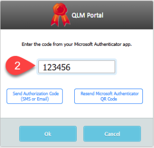

# QLM Portal Two-Factor Authentication

Applies To: QLM Portal

Version: 19.0.x

***

The QLM Portal can be configured to require two-factor authentication. To enable two-factor authentication you must do the following:

* Set the Server Property: portal / multiFactorAuthentication to allow any of the following authentications:
  * Send a code by email
  * Send a code by SMS
  * Use the Microsoft Authenticator app to get a code
* [Configure an SMTP Server](https://support.soraco.co/hc/en-us/articles/213887163) in order to send a verification code by email
* Configure an SMS provider and associate a mobile phone number to the user account in order to send a code by email &#x20;

When you enable Multi-Factor Authentication (MFA), a user who successfully authenticates with a username and password is then prompted to choose between different types of authentication.&#x20;

If only email and/or SMS authentication types are enabled, the verification is sent to the user's email or mobile phone number, provided a mobile number is available and an SMS provider is configured. The user must then enter this code in the QLM Portal login page.

If Microsoft Authenticator is enabled and selected, a QR code is sent only once to the user via email in order to register the QLM Portal with the Microsoft Authenticator. The user scans the QR code using the Microsoft Authenticator app, which creates a new entry named QlmPortal. The app then displays a code that the user must enter the to login to the QLM Portal.&#x20;

The benefit of Microsoft Authenticator is that users only need to receive one email to register with the Microsoft Authenticator. Once users have registered in the Microsoft Authenticator app, they can simply open the app, retrieve the code and enter it in the QlmPortal field during subsequent sign-ins.

&#x20;

<table data-header-hidden><thead><tr><th width="360.6666259765625"></th><th valign="middle"></th></tr></thead><tbody><tr><td></td><td valign="middle">
<figure><figcaption></figcaption></figure>
</td></tr></tbody></table>

&#x20;

**How to configure an SMS Provider**

To send the authorization code by SMS, you must use a 3rd party SMS provider. QLM is integrated with[ Twilio](https://www.twilio.com/) for sending SMS messages.

To configure your Twilio SMS settings:

* Go to the Manage Keys / Sites / Server Properties
* Locate the activation category
* Set the 3 properties: smsAccountNumber, smsAuthenticationToken, and smsPhoneNumber.

**Mobile Phone number**

To associate a mobile phone number with a user account, edit the user account from Manage Keys / User Accounts and set the mobile number. Note that if you are upgrading from a previous version of QLM, you must update the QlmLicenseServer and QlmPortal web.config files by adding the Mobile setting as shown in the screenshot below.

&#x20;

**MFA Email Template**

To configure the email template to be used when sending the authentication code to the user, set the server property portal/mfaEmailTemplate to the required email template. A ready-to-use template called "Portal.MFA" is provided but must be imported into the system as follows:

* Go to the Manage Keys tab
* Click Templates in the Mail section
* Click Import and go to the folder: C:\Program Files\Soraco\QuickLicenseMgr\EmailTemplates then select "Portal.MFA"
* Customize the template as needed (note that variables are not supported).
* Close the Templates Editor

**MFA QR Email Template**

To configure the email template to be used when sending the authentication code to the user, set the server property portal/mfaQREmailTemplate to the required email template. A ready-to-use template called "Portal.MFA\_QR" is provided but must be imported into the system as follows:

* Go to the Manage Keys tab
* Click Templates in the Mail section
* Click Import and go to the folder: C:\Program Files\Soraco\QuickLicenseMgr\EmailTemplates then select "Portal.MFA\_QR"
* Customize the template as needed (note that variables are not supported).
* Close the Templates Editor
